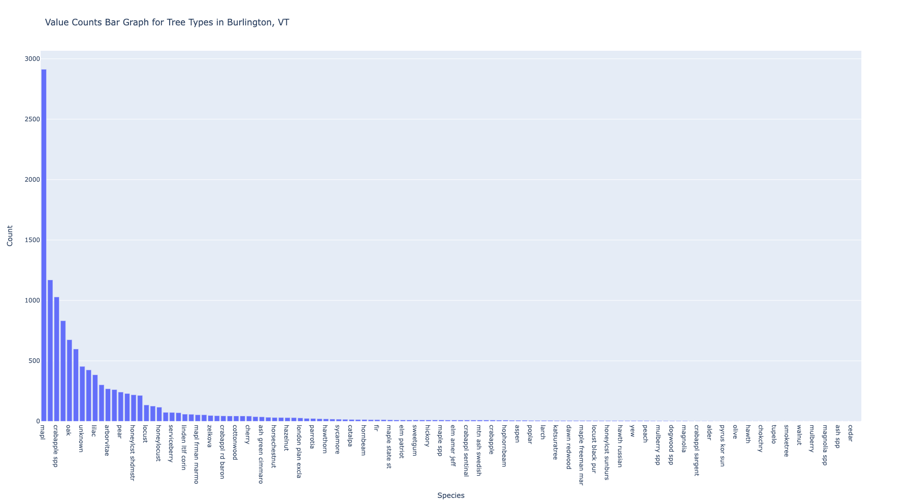
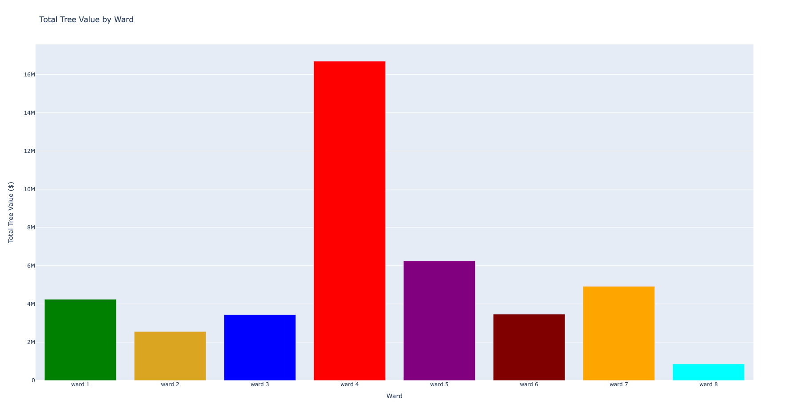
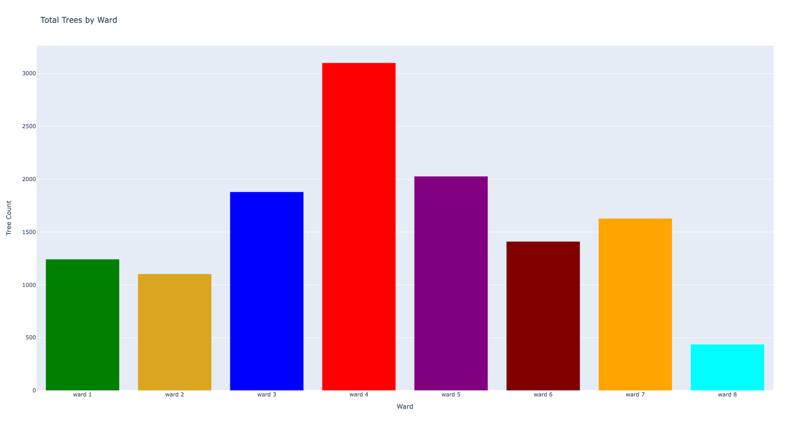
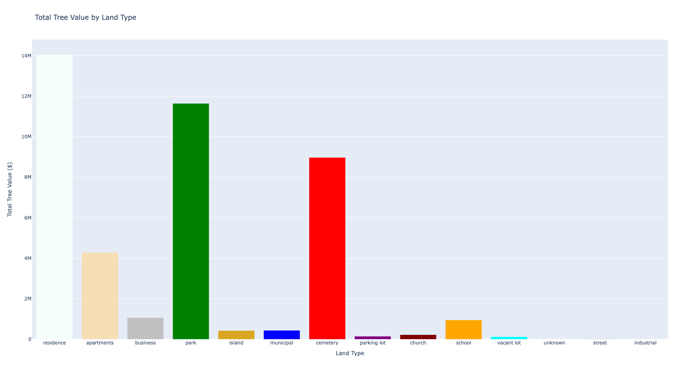
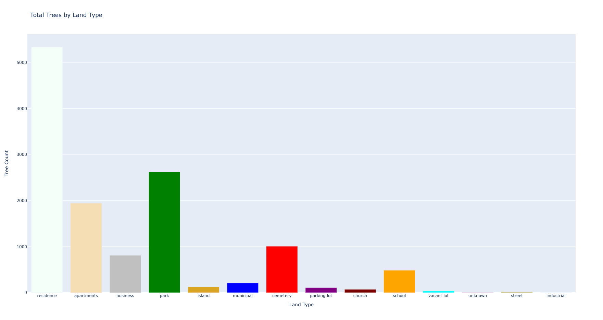

# Burlington Tree Analysis
Data is from BTV Stat located [here](https://data.burlingtonvt.gov/explore/dataset/planting-sites/information/).

12,836 trees in Burlington, VT. Includes species, appraisal value, location, type of land, some qualitative measurements.

Goal is to hopefully find some relationships within this dataset about location, species, and value.

# Data Cleaning
Let's first look at all of the missing values in this dataset per column.

| Column | Number of Missing Values |
| -----------| -------- |
| Geo Point | 0 |
| zone_id | 3 |
| site_id | 0 |
| modified | 0 |
| park | 9349 |
| landuse | 52 |
| site_typ | 0 |
| species | 603 |
| diameter | 0 |
| height | 0 |
| spread | 0 |
| trunks | 0 |
| conditn | 0 |
| appraise | 0 |
| planted | 0 |

The `park` variable looks pretty bad. Let's remove it, and use it later when we want to compare park value or tree distributions within parks.

Upon looking closer, we can see that the `species` column often has a species and a subspecies, separated by a comma. Let's try to parse this out and have a `species` and `subspecies` column.

Before Parsing:

| species |
| ------- |
| arborvitae |
| linden,littleleaf |
| mapl,frman celebr |
| oak,swamp amer dr |

After Parsing:

| species | subspecies |
| ------- | --------- |
| arborvitae | arborvitae |
| linden | littleleaf |
| mapl | frman celebr |
| oak | swamp amer dr |

Now we have a much cleaner dataset, with far less missing numbers and even a little more detailed.

# Analysis
For the analysis, I came up with a few general questions I could use this dataset to investigate, all related to tree distribution and value of different types of land by trees.  All data cleaning and graphing done in pandas and plotly respectively.

## Species counts

Here we can see a clear power law for species counts of trees. I am no tree expert but can definitely assume that tree type distributions are not often uniform, especially in areas where people have control over what grows where.

## Do different species have different values?

Looking at mean price per tree, we can see that some trees are appraised at a much higher value than others. The smoketree comes in at a whopping 25k with the majority of other trees falling below 5k USD in appraisal value.

## Ward value in terms of trees in that ward
Let's see if we can find some inequalities between wards. Not every ward is likely created equal (some may be more industrial and others may be more residential) so we cannot assume that they should look uniform.

| Mean Ward Value in Tree Appraisal | Total Ward Value in Tree Appraisal | Total Tree Count in Ward |
| ------------------------- | ------------------------- | ------------------------- |
| |  | |

## Land type value in terms of trees in that type of land
Similarly, we can do the same for land use types.
| Mean Land Type Value in Tree Appraisal | Total Land Type Value in Tree Appraisal | Total Tree Count in Land Type |
| ------------------------- | ------------------------- | ------------------------- |
| |  | |
